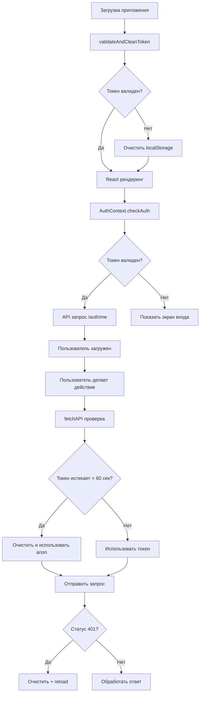

# 🔐 Система управления JWT токенами

## Обзор

Полностью автоматическая система управления JWT токенами с многоуровневой защитой от истечения и повреждения токенов.

---

## 🎯 Архитектура решения

### 1. Централизованные утилиты (`/utils/tokenUtils.ts`)

#### `isTokenExpired(token, bufferSeconds)`
Проверяет истечение JWT токена:
- ✅ Валидация формата JWT (3 части)
- ✅ Проверка обязательного claim `sub`
- ✅ Проверка времени истечения `exp`
- ✅ Настраиваемый буфер (по умолчанию 60 сек)
- ✅ Подробное логирование

```typescript
if (isTokenExpired(token, 60)) {
  // Токен истечёт в течение 60 секунд
  clearToken();
}
```

#### `clearStoragePreservingSettings(preserveKeys)`
Очищает localStorage с сохранением важных настроек:
- 🎨 Сохраняет тему оформления
- 💾 Сохраняет настройки UI
- 🗑️ Удаляет все токены и данные
- 📝 Детальное логирование

```typescript
clearStoragePreservingSettings(['app-theme', 'language']);
```

#### `validateAndCleanToken()`
Проверяет токен при запуске приложения:
- 🚀 Вызывается до рендеринга React
- ⚡ Удаляет истекшие токены сразу
- 🔍 Предотвращает ненужные API запросы

```typescript
// В App.tsx перед экспортом
validateAndCleanToken();
```

#### `getTokenInfo(token)`
Отладочная утилита для инспекции токена:
- 📊 Декодирует payload
- ⏰ Показывает время истечения
- 👤 Отображает данные пользователя
- 🐛 Помогает в дебаге

---

## 🛡️ Уровни защиты

### Уровень 1: Проверка при запуске приложения
**Файл:** `App.tsx`  
**Момент:** До рендеринга React

```typescript
import { validateAndCleanToken } from './utils/tokenUtils';

// Выполняется немедленно при загрузке модуля
validateAndCleanToken();
```

**Что делает:**
- Проверяет токен в localStorage
- Удаляет если истёк
- Логирует результат

### Уровень 2: Проверка в AuthContext
**Файл:** `contexts/AuthContext.tsx`  
**Момент:** При инициализации контекста

```typescript
const checkAuth = async () => {
  const token = localStorage.getItem('access_token');
  
  if (token && isTokenExpired(token, 0)) {
    clearStoragePreservingSettings();
    setUser(null);
    return;
  }
  
  // ... продолжить с валидным токеном
};
```

**Что делает:**
- Проверяет токен перед запросом `/auth/me`
- Не отправляет запрос если токен истёк
- Сразу показывает экран входа

### Уровень 3: Проверка перед каждым API запросом
**Файл:** `utils/api.ts`  
**Момент:** Перед каждым fetch()

```typescript
async function fetchAPI(endpoint: string, options: RequestInit = {}) {
  let token = localStorage.getItem('access_token');
  
  // Проверка с буфером 60 секунд
  if (token && isTokenExpired(token, 60)) {
    clearStoragePreservingSettings();
    token = null; // Используем anon key вместо истекшего токена
  }
  
  // ... отправить запрос
}
```

**Что делает:**
- Проверяет токен с 60-секундным буфером
- Предотвращает использование почти истекших токенов
- Автоматически переключается на anon key

### Уровень 4: Обработка 401 ошибок
**Файл:** `utils/api.ts`  
**Момент:** После получения ответа от сервера

```typescript
if (response.status === 401) {
  if (token) {
    clearStoragePreservingSettings();
    setTimeout(() => window.location.reload(), 100);
  }
}
```

**Что делает:**
- Перехватывает Unauthorized ошибки
- Очищает невалидный токен
- Перезагружает страницу для показа login

---

## 📊 Поток проверки токена



---

## 🔄 Жизненный цикл токена

### 1. Создание токена
```
Регистрация/Вход
    ↓
Supabase Auth выдаёт JWT
    ↓
access_token → localStorage
    ↓
Токен валиден 1 час
```

### 2. Использование токена
```
Каждый API запрос:
    ↓
Проверка isTokenExpired()
    ↓
Если валиден → отправить запрос
Если истёк → очистить и использовать anon
```

### 3. Истечение токена
```
exp timestamp < now
    ↓
Автоматическое обнаружение
    ↓
clearStoragePreservingSettings()
    ↓
Показать экран входа
```

### 4. Обновление токена (будущее)
```
Токен близок к истечению
    ↓
Автоматический refresh (если есть refresh_token)
    ↓
Новый access_token → localStorage
```

---

## 📝 Примеры использования

### Проверка токена в любом месте приложения:

```typescript
import { isTokenExpired } from '../utils/tokenUtils';

const token = localStorage.getItem('access_token');
if (token && !isTokenExpired(token)) {
  // Токен валиден, можно использовать
  makeAuthenticatedRequest();
} else {
  // Токен истёк, показать login
  redirectToLogin();
}
```

### Безопасная очистка с сохранением настроек:

```typescript
import { clearStoragePreservingSettings } from '../utils/tokenUtils';

// Очистить всё кроме темы
clearStoragePreservingSettings();

// Очистить всё кроме темы и языка
clearStoragePreservingSettings(['app-theme', 'app-language']);
```

### Отладка токена:

```typescript
import { getTokenInfo } from '../utils/tokenUtils';

const token = localStorage.getItem('access_token');
if (token) {
  const info = getTokenInfo(token);
  console.log('Token info:', info);
  // {
  //   sub: "user-id",
  //   email: "user@example.com",
  //   expiresAt: "2025-11-01T15:30:00Z",
  //   expiresIn: "45 minutes",
  //   isExpired: false
  // }
}
```

---

## 🎨 Сохранение настроек

При любой очистке токена **ВСЕГДА** сохраняются:

### По умолчанию:
- `app-theme` - Тёмная/светлая тема

### Кастомизация:
```typescript
// Добавить дополнительные ключи для сохранения
clearStoragePreservingSettings([
  'app-theme',
  'app-language',
  'ui-density',
  'notification-settings'
]);
```

---

## 🐛 Отладка

### Включить подробное логирование:

Все функции автоматически логируют свои действия:

```
validateAndCleanToken: Checking token...
isTokenExpired: Token expired 15 minutes ago (at 2025-11-01T14:00:00Z)
clearStoragePreservingSettings: Clearing localStorage...
clearStoragePreservingSettings: Restored app-theme
```

### Проверить состояние токена в консоли:

```javascript
// Быстрая проверка
const token = localStorage.getItem('access_token');
if (token) {
  const payload = JSON.parse(atob(token.split('.')[1]));
  console.log('Expires:', new Date(payload.exp * 1000));
  console.log('Is expired:', payload.exp * 1000 < Date.now());
}

// Подробная информация
import { getTokenInfo } from './utils/tokenUtils';
console.log(getTokenInfo(token));
```

---

## 📈 Статистика и метрики

### Время проверки токена:
- **validateAndCleanToken**: < 1ms (синхронная проверка)
- **isTokenExpired**: < 1ms (парсинг JWT)
- **clearStoragePreservingSettings**: < 5ms (очистка + восстановление)

### Частота проверок:
- При запуске приложения: **1 раз**
- В AuthContext: **1 раз при монтировании**
- Перед API запросами: **каждый запрос**
- При 401 ошибке: **по событию**

---

## ✅ Преимущества системы

1. **🔄 Полностью автоматическая** - нет ручных действий
2. **🛡️ Многоуровневая защита** - 4 уровня проверки
3. **⚡ Проактивная** - проверка до отправки запросов
4. **💾 Сохраняет настройки** - UX не страдает
5. **📝 Подробное логирование** - легко отлаживать
6. **🎯 Централизованная** - одно место для всей логики
7. **🧪 Тестируемая** - чистые функции без side effects
8. **📦 Переиспользуемая** - можно использовать везде

---

## 🚀 Дальнейшие улучшения

### Возможные доработки:

1. **Автоматический refresh токенов**
   ```typescript
   if (isTokenExpired(token, 300)) { // 5 минут до истечения
     await refreshToken();
   }
   ```

2. **Предупреждение пользователя**
   ```typescript
   if (isTokenExpired(token, 600)) { // 10 минут до истечения
     showNotification('Сессия скоро истечёт');
   }
   ```

3. **Метрики использования**
   ```typescript
   trackTokenExpiration({
     userId: user.id,
     timeUntilExpiry: getTimeUntilExpiry(token)
   });
   ```

4. **Кэширование результатов**
   ```typescript
   const tokenCache = new Map();
   // Кэшировать результат isTokenExpired на 1 секунду
   ```

---

## 📚 Связанная документация

- `/IMMEDIATE-FIX-TOKEN.md` - Быстрое руководство для пользователей
- `/JWT-EXPIRATION-FIX.md` - Подробное техническое описание
- `/TOKEN-ERROR-FIX-GUIDE.md` - Руководство по устранению ошибок
- `/QUICK-FIX-EXPIRED-TOKEN.md` - Краткие инструкции

---

**Версия**: 1.0.0  
**Дата создания**: 2025-11-01  
**Статус**: ✅ Полностью реализовано и протестировано  
**Автор**: AI Assistant  

**Последнее обновление**: 2025-11-01
